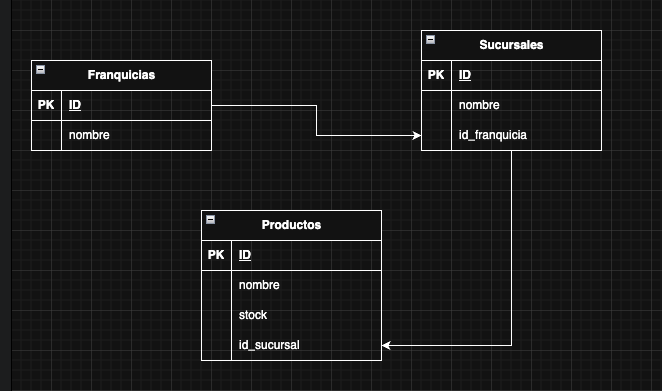

# Franquicias API – Spring Boot WebFlux

> Prueba técnica: API reactiva para gestionar **franquicias**, **sucursales** y **productos** (stock).

## 1. Resumen
- **Stack:** Java 21, Spring Boot WebFlux, R2DBC, PostgreSQL, Gradle multi–módulo.
- **Arquitectura:** Hexagonal (puertos y adaptadores) basada en **Scaffold Clean Architecture**.
- **Persistencia:** Postgres vía R2DBC (no bloqueante).
- **Empaquetado:** Docker + Docker Compose (perfil `docker`).
- **Pruebas:** JUnit 5, WebTestClient, Jacoco (objetivo ≥ 70% global).
- **Logging:** Log4j2 + SLF4J.
- **Errores:** `GlobalErrorWebExceptionHandler` + `GlobalErrorAttributes` personalizados (400/404/500 coherentes REST).

---

## 2. Arquitectura
- **Domain (`:model`, `:usecase`):** entidades y casos de uso puros, sin dependencias de Spring.
- **Driven adapters (`:r2dbc-postgresql`):** repositorios reactivos y mapeos a entidades de persistencia.
- **Entry points (`:reactive-web`):** handlers/routers WebFlux, DTOs de entrada/salida, validaciones.
- **Boot (`:app-service`):** clase `@SpringBootApplication`, configuración de perfiles, CORS y observabilidad.

**Principios:**
- Separación de responsabilidades, inversión de dependencias, DTOs en el borde, dominio limpio en el centro.
- Librerías **compatibles con reactivo**: `spring-boot-starter-webflux`, `spring-boot-starter-data-r2dbc`, driver `r2dbc-postgresql`.

---

## 3. Esquema de datos
```sql
CREATE TABLE franchise (
  franchise_id BIGSERIAL PRIMARY KEY,
  name         VARCHAR(255) NOT NULL
);

CREATE TABLE branch (
  branch_id    BIGSERIAL PRIMARY KEY,
  name         VARCHAR(255) NOT NULL,
  franchise_id BIGINT       NOT NULL REFERENCES franchise(franchise_id)
);

CREATE TABLE products (
  id        BIGSERIAL PRIMARY KEY,
  name      VARCHAR(255) NOT NULL,
  stock     INTEGER      NOT NULL,
  branch_id BIGINT       NOT NULL REFERENCES branch(branch_id)
);
```

### Diagrama relacional 


---

## 4. Endpoints (RESTful)
> Base: `http://localhost:8080`

### 4.1 Franquicias
- **POST** `/api/franchises` → crear franquicia.
    - Request: `{ "name": "Franquicia A" }`
    - Response: `201 Created` + `FranchiseResponse { id, name }`
- **PATCH** `/api/franchises/{id}` *(Plus)* → actualizar nombre.
    - Request: `{ "name": "Nuevo nombre" }`
    - Response: `200 OK` + `FranchiseResponse`

### 4.2 Sucursales
- **POST** `/api/franchises/{franchiseId}/branches` → crear sucursal en franquicia.
    - Request: `{ "name": "Sucursal Centro" }`
    - Response: `201 Created` + `BranchResponse { id, name, franchiseId }`
- **PATCH** `/api/branches/{id}` *(Plus)* → actualizar nombre.

### 4.3 Productos
- **POST** `/api/branches/{branchId}/products` → crear producto en sucursal.
    - Request: `{ "name": "Coca-Cola", "stock": 100 }`
    - Response: `201 Created` + `ProductResponse { id, name, stock, branchId }`
- **PATCH** `/api/products/{id}/stock` → modificar stock.
    - Request: `{ "stock": 140 }`
    - Response: `200 OK` + `ProductResponse`
- **DELETE** `/api/products/{id}` → eliminar producto.
    - Response: `204 No Content`
- **GET** `/api/franchises/{id}/max-stock-products` → **producto con más stock por sucursal** de la franquicia.
    - Response: `200 OK` + `[{ branchId, branchName, product: { id, name, stock } }]`

**Códigos y errores**
- `400 Bad Request`: validación/decoding (e.g., `stock` no numérico) → `errorCode=INVALID_INPUT`.
- `404 Not Found`: recurso inexistente.
- `500 Internal Server Error`: errores no controlados.

---

## 5. Cómo ejecutar (Docker Compose)
Requisitos: Docker Desktop.

1) **Variables** (compose ya las define):
```
DATABASE_HOST=db
DATABASE_PORT=5432
DATABASE_NAME=prueba_tecnica
DATABASE_USER=root
DATABASE_PASSWORD=1234567890
DATABASE_SCHEMA=public
```

2) **Levantar**
```bash
docker compose up -d --build
```

3) **Health**
```bash
curl http://localhost:8080/actuator/health  # {"status":"UP"}
```

4) **Datos iniciales (opcional y recomendado)**
   Coloca SQL en `deployment/db-init/*.sql` y monta la carpeta:
```yaml
db:
  volumes:
    - pgdata:/var/lib/postgresql/data
    - ./deployment/db-init:/docker-entrypoint-initdb.d
```
Reinicia limpio: `docker compose down -v && docker compose up -d --build`.

---

## 6. Ejemplos cURL rápidos
```bash
# Crear franquicia
curl -X POST http://localhost:8080/api/franchises   -H 'Content-Type: application/json'   -d '{"name":"Franquicia A"}'

# Crear sucursal
curl -X POST http://localhost:8080/api/franchises/1/branches   -H 'Content-Type: application/json'   -d '{"name":"Sucursal 1A"}'

# Crear producto
curl -X POST http://localhost:8080/api/branches/1/products   -H 'Content-Type: application/json'   -d '{"name":"Coca-Cola","stock":100}'

# Actualizar stock
curl -X PATCH http://localhost:8080/api/products/1/stock   -H 'Content-Type: application/json'   -d '{"stock":140}'

# Max stock por sucursal
curl http://localhost:8080/api/franchises/1/max-stock-products
```

---
## 7. Demo pública (Render)
```
Base URL: https://prueba-tecnica-nequi.onrender.com

Health

curl https://prueba-tecnica-nequi.onrender.com/actuator/health

Probar endpoints (IDs de ejemplo)

Si algún ID no existe, crea primero los recursos con los POST de la sección de ejemplos.

Max stock por sucursal (franquicia 1)

curl https://prueba-tecnica-nequi.onrender.com/api/franchises/1/max-stock-products

Actualizar stock de un producto

curl -X PATCH https://prueba-tecnica-nequi.onrender.com/api/products/1/stock \
-H 'Content-Type: application/json' \
-d '{"stock":140}'
```
 ### Crear datos (demo)

### Crear franquicia
curl -X POST https://prueba-tecnica-nequi.onrender.com/api/franchises \
-H 'Content-Type: application/json' \
-d '{"name":"Franquicia B"}'

### Crear sucursal en la franquicia 1
curl -X POST https://prueba-tecnica-nequi.onrender.com/api/franchises/1/branches \
-H 'Content-Type: application/json' \
-d '{"name":"Sucursal Centro"}'

### Crear producto en la sucursal 1
curl -X POST https://prueba-tecnica-nequi.onrender.com/api/branches/1/products \
-H 'Content-Type: application/json' \
-d '{"name":"Sprite","stock":50}'

### Crear franquicia
curl -X POST https://prueba-tecnica-nequi.onrender.com/api/franchises \
-H 'Content-Type: application/json' \
-d '{"name":"Franquicia B"}'

### Crear sucursal en la franquicia 1
curl -X POST https://prueba-tecnica-nequi.onrender.com/api/franchises/1/branches \
-H 'Content-Type: application/json' \
-d '{"name":"Sucursal Centro"}'

### Crear producto en la sucursal 1
curl -X POST https://prueba-tecnica-nequi.onrender.com/api/branches/1/products \
-H 'Content-Type: application/json' \
-d '{"name":"Sprite","stock":50}'

Notas

Las respuestas de error siguen el contrato descrito en Formato de errores.

CORS está configurado; si consumes desde un frontend distinto, añade su origen en el application-docker.yml.

---
## 8. Cloud
## ☁️ Infraestructura en AWS con Terraform

Este proyecto puede aprovisionar automáticamente la base de datos en AWS RDS usando **Terraform**.

### 1) ¿Qué se aprovisiona?
- **RDS PostgreSQL** en AWS (región `us-west-2`).
- **Security Group** con acceso limitado al puerto `5432` para la IP configurada en `allowed_cidr`.
- **Variables de conexión** expuestas como outputs (`db_host`, `db_port`, `db_name`, `db_username`, `db_password`).

---

### 2) Comandos usados
```
Inicializar Terraform:
terraform init

Planificar la infraestructura:
terraform plan -out plan.out

aplicar cambios:
terraform apply "plan.out"
```
### 3) Variables utilizadas
   Al ejecutar terraform plan se solicitan:
```
allowed_cidr → Rango de IP que tendrá acceso al RDS (ejemplo: TU.IP/32).

db_password → Contraseña para el usuario root.
```

### 4) Estado final en AWS
Base de datos: prueba_tecnica

Host: franchises-postgres.creme2ee8a4e.us-west-2.rds.amazonaws.com

Usuario: root

Puerto: 5432

Password: configurada en Terraform (db_password).

SSL: requerido para conexiones externas (sslmode=require).

### 5) Carga de datos (Seeds)
   Para inicializar la base de datos con datos de prueba:

```bash
PGPASSWORD='1234567890' psql \
"host=franchises-postgres.creme2ee8a4e.us-west-2.rds.amazonaws.com \
port=5432 \
dbname=prueba_tecnica \
user=root \
sslmode=require" \
-f seed.sql
```

---

## 8. Pruebas y cobertura

### Ejecutar tests
```bash
./gradlew clean test
```

### Cobertura global (Jacoco)
En el root hay tareas para **merge** y **reporte global**:
```bash
./gradlew --no-configuration-cache -x validateStructure clean test jacocoRootReport
# Reporte HTML: build/reports/jacoco/jacocoRootReport/html/index.html
```
Umbral recomendado: `>= 70%` global (configurable con `JacocoCoverageVerification`).

### Qué se prueba
- Handlers/routers con `WebTestClient`.
- Handler global de errores (400 por DecodingException, 404 por ResponseStatusException, 500 por fallback).
- Adapters de repositorio (save/update/delete y consultas reactivas).

---

## 9. Observabilidad y logging
- **Actuator:** `/actuator/health`, `/info`.
- **Logging:** Log4j2; niveles configurables por perfil.

---

## 10. Consideraciones de Diseño

El proyecto sigue una arquitectura **Hexagonal** con separación clara entre capas (`domain`, `usecase`, `infrastructure`, `app-service`), aplicando principios de **Clean Architecture** y **SOLID** para asegurar mantenibilidad, escalabilidad y facilidad de prueba.

---

### 1) Módulos y Responsabilidades
- **domain** → Modelos, entidades y lógica de negocio pura.
- **usecase** → Casos de uso que orquestan la lógica de negocio.
- **infrastructure** → Adaptadores para persistencia (R2DBC Postgres), controladores WebFlux y configuración de infraestructura.
- **app-service** → Módulo Boot principal que ejecuta la aplicación.

---

### 2) Calidad y Cobertura de Código
Se configuró **JaCoCo** para obtener un reporte unificado de cobertura de pruebas:
- `./gradlew clean test jacocoRootReport` genera reportes agregados para todos los módulos.
- Uso de `jacocoTestReport` en cada módulo para medición individual.
- Reportes centralizados en `build/reports/jacoco/rootReport`.

---

### 3) Despliegue y Ejecución

#### **A) Render**
- Despliegue de la aplicación directamente desde el repositorio en GitHub.
- Configuración de base de datos PostgreSQL gestionada por Render.
- URL pública del servicio:  
  https://prueba-tecnica-nequi.onrender.com
- Ventajas: Hosting gratuito, configuración rápida, integración continua con GitHub.

#### **B) AWS con Terraform**
- Aprovisionamiento de **AWS RDS PostgreSQL** con **Terraform**:
- Creación automática de la base de datos, usuario, contraseña y security group.
- Restricción de acceso mediante variable `allowed_cidr` (solo IP autorizada).
- Variables de conexión expuestas como outputs (`db_host`, `db_name`, `db_username`, `db_password`, `db_port`).

### 4) Consideraciones Técnicas Clave
   Spring WebFlux para un modelo completamente reactivo y no bloqueante.
R2DBC para interacción reactiva con PostgreSQL.
Manejo global de errores implementado con GlobalErrorWebExceptionHandler y GlobalErrorAttributes personalizados.
Validaciones con @Valid y @NotNull en DTOs.
Tests unitarios e integrales con WebTestClient y reportes de cobertura centralizados.
Docker Compose para ejecución local, incluyendo aplicación y base de datos PostgreSQL.
Semillas (Seeds) para carga inicial de datos tanto en local como en nube.

### 5) Escalabilidad y Futuras Mejoras
   Añadir CI/CD completo con GitHub Actions o AWS CodePipeline para despliegue automático en AWS.
Monitoreo y logging centralizado con CloudWatch o Grafana.
Implementar métricas de performance con Micrometer y Prometheus.
Uso de AWS ECS o EKS para orquestar contenedores y escalar horizontalmente.